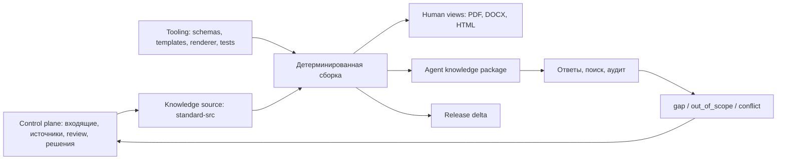

# Потребители стандарта и доступ агентов к знаниям

Связано с [[01_Projects/001_77_Standard_iRidi/Standard_iRidi_MOC]], [[01_Projects/001_77_Standard_iRidi/Artifacts/Documentation/Standard_As_Code_Architecture_v1]], [[01_Projects/001_77_Standard_iRidi/Artifacts/Machine_Readable/Standard_Book_Manifest_MOC]] и [[01_Projects/001_77_Standard_iRidi/Reviews/2026-08-05_Standard_As_Code_Architecture_Review]].

## 1. Что подтвердил первичный источник

Нужная запись найдена: разговор 30 июня 2026 года с генеральным директором. Полный транскрипт прочитан в закрытом source-контуре. В проект перенесены только обезличенные выводы; сырой текст не копируется. Запись 10 июля подтверждает последующее развитие той же модели.

Главный вывод: результат проекта — не только длинная книга. Это проверенное ядро технических знаний, из которого человек или агент получает нужную проекцию под свою работу. Книга остается обязательным human-readable представлением и объектом реконструкционной приемки, но не единственным способом потребления.

На встрече подтверждены четыре контура ценности:

1. первоначальное обучение и формирование правильного технического стандарта в голове;
2. оперативная помощь в продаже, пресейле, проектировании, монтаже и проверке решения;
3. технический QA разговоров, расчетов и проектных решений;
4. обратный поток: незакрытый рыночный запрос становится кандидатом на доработку стандарта или продукта.

## 2. Кто является потребителем

### Человеческие аудитории

| Аудитория | Задача | Что ей нужно получить |
| --- | --- | --- |
| Начинающий инсталлятор | войти в профессию и не изобретать решение заново | основы технологии, рекомендуемая архитектура, объяснение «почему так», типовые ошибки, схемы и проверка усвоения |
| Опытный интегратор / руководитель проекта интегратора | быстро свериться со стандартом и унифицировать команду | нормы, варианты, границы применимости, типовые узлы, критерии приемки |
| Проектировщик / инженер | подобрать состав и оформить решение | правила подбора, совместимость, расчеты, схемы, кабели, ограничения и проверяемые rule UID |
| Монтажник / ПНР / сервис | правильно собрать, подключить, проверить и диагностировать | монтажные узлы, подключения, параметры, последовательность проверки и признаки неисправности |
| Менеджер продаж | корректно объяснить ценность и не обещать невозможное | возможности, ограничения, вопросы клиенту, сравнение вариантов, короткие объяснения и ссылки на подробности |
| Пресейл-инженер | быстро решить запрос и проверить расчет проекта | паттерны решений, требования, BOM/совместимость, нормы, исключения и формальный audit result |
| Академия / тренер | обучить и доучить команду | учебные траектории, тестируемые темы, release delta, типовые ошибки по ролям |
| Продукт / разработка | понять, чего не хватает рынку или документации | gaps, частые вопросы, неподдержанные сценарии, связь с релизами и решениями |
| Руководитель / QA | понимать качество применения стандарта | агрегированные нарушения, пробелы обучения, спорные нормы и изменения между выпусками |

Конечный заказчик объекта пока не является прямой основной аудиторией полного стандарта. Он является участником разговора, для которого продажи и пресейл формируют понятное объяснение. Если позже понадобится клиентское представление, оно должно быть отдельным generated profile, а не упрощением канона.

### Машинные потребители

`agent` не следует смешивать с человеческой аудиторией. Агент — это приложение, действующее от имени конкретной роли и задачи.

| Приложение | Роль, от имени которой работает | Результат |
| --- | --- | --- |
| Справочный агент | любая разрешенная роль | точный ответ с release, UID и ссылками на фрагменты стандарта |
| Агент технического QA продаж | продажи / руководитель | что сказано неверно, что не договорено, что надо доучить |
| Пресейл-аудитор | пресейл / проектировщик | соответствия, нарушения, недостающие входные данные и применимые нормы |
| Учебный агент | Академия / сотрудник | персональный маршрут, вопросы, тесты и delta после нового выпуска |
| Агент редакции | владелец стандарта | редакционное задание, impact analysis, candidate changes; без автоматического approve |
| Агент рыночных пробелов | продукт / разработка | `gap`, `out_of_scope` или кандидат продуктовой доработки с источником |
| Агент релизов | обучение / продажи / Wiki | кому что изменилось и какой downstream-артефакт требуется обновить |
| Компилятор Project Tool | проектировщик | машинные правила подбора и совместимости; отдельный строгий контракт, не свободный текстовый поиск |

## 3. Главное архитектурное разделение

Служебные материалы проекта, редактируемый канон и пакет потребления нельзя смешивать физически.



Предлагаемая физическая структура после approve:

```text
001_77_Standard_iRidi/
  Inbox/ Sources/ Reviews/ Decisions/ Backlog/ Archive/
                                  # control plane: почему и кто меняет
  Artifacts/                      # архитектура, QA, human projections
  Workspace/77_Стандарт_iRidi/
    standard-src/                 # только редактируемое знание
      book.yaml
      taxonomy/
      sections/
      entities/
      assets/
    tooling/                      # как знание проверяется и собирается
      schemas/
      templates/
      theme/
      renderers/
      tests/
    build/                        # временные результаты, не канон
    releases/
      1.2.0/
        release.yaml
        human/
        agent/
        deltas/
```

Граница доступа:

- потребляющий агент получает только `releases/<version>/agent/`;
- редакционный агент получает `control plane + standard-src`, но не публикует без approve;
- сборщик получает `standard-src + tooling`, но не принимает редакционных решений;
- независимый приемщик получает immutable baseline, release candidate и acceptance contract;
- raw-транскрипты, личные данные, Buffer и unresolved proposals не входят в release package.

## 4. Что лежит в agent knowledge package

Пакет выпуска генерируется, а не редактируется вручную:

```text
releases/1.2.0/agent/
  START_HERE.md            # короткий контракт работы для нового агента
  package.yaml             # версия, язык, scope, checksums, разрешенные профили
  navigation.json          # дерево разделов и точки входа
  topics.jsonl             # карточки тем
  rules.jsonl              # нормы и применимость
  entities.jsonl           # продукты, протоколы, capability и роли
  relations.jsonl          # связи topic-rule-entity-asset
  aliases.json             # терминология, синонимы, прежние названия
  changes.jsonl            # delta этого выпуска
  indexes/
    by_audience.json
    by_job.json
    by_domain.json
    by_lifecycle.json
    by_entity.json
  content/by-uid/*.md      # опубликованные содержательные фрагменты
  assets/                  # разрешенные опубликованные изображения и схемы
```

Индексы являются производными от метаданных `standard-src`. Ручное редактирование индекса запрещено: иначе поиск и книга разойдутся.

## 5. Карточка знания

Базовая карточка темы должна отвечать не только «где текст», но и «когда агенту сюда идти»:

```yaml
uid: std_topic_lighting_dimming_selection
title: "Выбор способа диммирования"
summary: "Как выбрать технологию и объяснить ее ограничения"
answers_questions:
  - "Какой тип диммирования заложить?"
  - "Что объяснить заказчику при выборе?"
aliases: [диммирование, регулировка яркости, DALI, 0-10V, TRIAC]
audiences: [integrator, designer, sales, presales, training]
jobs: [learn, explain, select, calculate, audit, troubleshoot]
domains: [lighting]
lifecycle: [sale, design, commissioning]
entity_refs: [capability:dimming]
rule_refs: [std_rule_lighting_dimming_001]
coverage_status: documented
release: 1.2.0
content_ref: content/by-uid/std_topic_lighting_dimming_selection.md
```

Обязательное различие:

- `audiences` — человеческие роли;
- `jobs` — что человек или агент пытается сделать;
- `consumer_application` — тип агента/системы;
- `domains/entities/lifecycle` — предметные фильтры;
- `coverage_status` — почему ответ найден или не найден.

## 6. Как агент быстро находит знание без векторной базы

Первый рабочий контур должен быть детерминированным и проверяемым. Векторный поиск можно добавить позже как recall-helper, но он не становится источником ответа.

1. Агент открывает `START_HERE.md` и `package.yaml`, фиксирует release и разрешенный профиль.
2. Классифицирует запрос по четырем фасетам: роль, задача, домен, стадия проекта.
3. Ищет точные UID, aliases и термины в производных индексах.
4. Получает несколько topic cards и применимые rule UID.
5. Раскрывает только один уровень связей и читает нужные `content/by-uid/*.md`.
6. Возвращает ответ с release, coverage status и citations.
7. Если ответа недостаточно, не фантазирует: фиксирует `gap`, `out_of_scope`, `conflict`, `deprecated` или `needs_input`.

Для пользователя и агента это один интерфейс:

```text
standard_book query --text "какие модули заложить для диммирования" --audience presales
standard_book get --uid std_rule_lighting_dimming_001
standard_book audit --input project-package.yaml --profile presales
standard_book changes --since 1.2.0 --audience training
```

MCP в дальнейшем вызывает тот же query layer. CLI, MCP и книга не должны иметь три разных логики поиска.

## 7. Контракт ответа

Любой машинный ответ должен включать:

- `answer_status`: `documented | gap | out_of_scope | conflict | deprecated | needs_input`;
- `release` и дату выпуска;
- краткий ответ;
- применимость и исключения;
- topic/rule UID;
- точные citations на released content;
- уровень нормы: факт, рекомендация, обязательное правило, запрет;
- следующий шаг, если данных не хватает.

Для аудита проекта дополнительно нужны: проверенные входные данные, найденные нарушения, отсутствующие сведения, список применимых правил и общий результат `pass | fail | needs_input`. Это защищает от ситуации, когда агент выдает красивое объяснение вместо проверки.

## 8. Что не следует объединять

1. Текстовая энциклопедия и технический компилятор Project Tool используют общее знание, но разные контракты. Размещение компонентов и генерация схем требуют формальных портов, совместимости и расчетных ограничений.
2. Продажный QA и технический QA — разные проверки, хотя используют один transcript и один release стандарта.
3. Обучающий материал не является каноном: он генерируется из канона под роль и уровень сотрудника.
4. Векторный индекс не заменяет UID, rule records и citations.
5. Рыночный запрос не становится нормой автоматически. Сначала определяется: пробел документации, продуктовый gap или осознанный `out_of_scope`.

## 9. Рекомендуемое решение D11

Утвердить модель `knowledge kernel + generated projections`:

- физически разделить control plane, `standard-src`, `tooling`, `build` и immutable `releases`;
- считать человеческие аудитории и машинные приложения разными измерениями метаданных;
- выдавать внешним агентам только released agent package;
- сделать фасетный registry/UID search обязательным первым уровнем, embeddings — необязательным вторым;
- использовать один query contract для CLI и будущего MCP;
- не включать Project Tool compiler в свободный текстовый RAG: для него нужен отдельный typed engineering contract.

## 10. Что делать после согласования

1. Добавить JSON Schema для topic card, rule, entity, relation и answer contract.
2. На lossless-import раздела «Освещение» автоматически построить первые `topics.jsonl`, `rules.jsonl` и индексы.
3. Проверить четыре сценария: справочный ответ, продажное объяснение, пресейл-аудит, training delta.
4. Проверить отрицательные сценарии: неизвестный вопрос, осознанный `out_of_scope`, конфликт и недостаточные данные.
5. Только после этого решать, нужен ли embeddings-индекс и MCP; базовый package должен работать локально без них.

