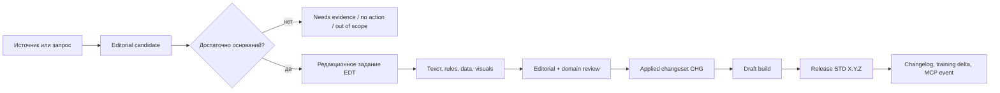
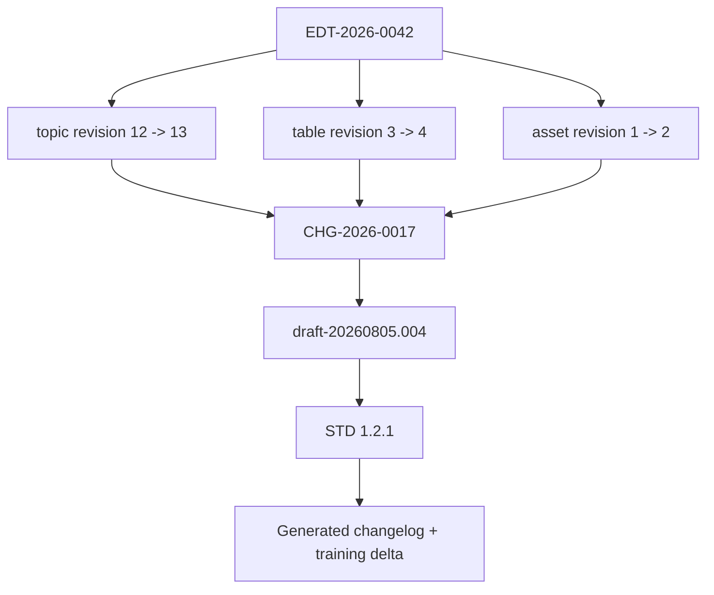

# Редакционное задание и версионность стандарта

Связано с [[01_Projects/001_77_Standard_iRidi/Artifacts/Documentation/Standard_As_Code_Architecture_v1]], [[01_Projects/001_77_Standard_iRidi/Artifacts/Documentation/Standard_Content_Refactoring_And_Template_Model_v1]], [[01_Projects/001_77_Standard_iRidi/Artifacts/Documentation/Standard_Reconstruction_Parity_Acceptance_v1]], [[01_Projects/001_77_Standard_iRidi/Workspace/77_Стандарт_iRidi/VERSIONING]], [[01_Projects/001_77_Standard_iRidi/Artifacts/Machine_Readable/Standard_Book_Manifest_MOC]] и [[01_Projects/001_77_Standard_iRidi/Archive/Reviews/Applied/2026-08-05_Standard_As_Code_Architecture_Review]].

## 1. Рекомендуемое решение

Редакционное задание — это не свободная просьба «добавить текст в книгу». Это исполняемый контракт изменения, который связывает входящий сигнал с конкретным результатом в стандарте:



Каждый опубликованный фрагмент должен объясняться цепочкой:

```text
source_ref -> editorial_job_uid -> changed_uids -> changeset_uid -> release_uid
```

## 2. Когда появляется редакционное задание

Не каждый входящий сигнал автоматически становится работой над книгой.

1. Источник поступает от разработки, рынка, интегратора, продаж, пресейла, владельца, обучения, поддержки или QA.
2. Сигнал получает disposition: `already_documented`, `editorial_gap`, `product_gap`, `out_of_scope`, `conflict`, `needs_evidence`, `noise`.
3. Только `editorial_gap`, подтвержденное уточнение или approved content change превращается в редакционное задание.
4. Если нужен новый продуктовый ответ или решение владельца, редакционное задание остается blocked и не изобретает содержание.

Один источник может породить несколько заданий, если меняются разные разделы, требуются разные эксперты или разные release gates. Несколько однородных источников можно объединить в одно задание с полным списком source refs.

## 3. На какие вопросы отвечает редакционное задание

### Идентичность и происхождение

- Какой у задания постоянный `editorial_job_uid`?
- Кто инициатор и кто фактический источник знания?
- Когда и через какой канал оно пришло?
- Какие source locators подтверждают запрос?
- Какова authority и confidence источников?

### Проблема читателя

- Что именно сейчас непонятно, отсутствует, противоречит или устарело?
- Для какой аудитории: интегратор, пресейл, продажи, проектировщик, ПНР, обучение, агент?
- Какой вопрос читатель должен суметь закрыть после изменения?
- Что произойдет, если ничего не менять?

### Смысловая позиция стандарта

- Это product fact, норма, рекомендация, ограничение, rationale, пример или процедура?
- Стандарт должен дать ответ, объявить `out_of_scope` или зафиксировать gap?
- Меняется ли существующая рекомендация?
- Есть ли конфликт с другими rules/facts?
- Нужен ли domain/owner decision?

### Точный scope

- Какие chapter/topic/rule/data/asset UID затрагиваются?
- Куда материал добавляется и почему именно туда?
- Нужен новый topic/section или достаточно изменить существующий?
- Какие cross-references и publication profiles затрагиваются?
- Что явно не входит в задание?

### План представления

- Какой текстовый результат нужен: правило, объяснение, пример, checklist, инструкция, таблица?
- Нужна ли визуализация и какую задачу она решает?
- Как текст и визуализация делят объяснение между собой?
- Какие исходные данные, подписи, единицы, labels и source refs обязательны?

### Результат и приемка

- Какие конкретные artifacts должны измениться или появиться?
- Как проверить смысл, непротиворечивость и визуальную корректность?
- Какой reviewer нужен?
- Как выглядит `done`, какие residuals допустимы?

### Версионность и downstream impact

- На какой released book version опиралось задание?
- Какие unit revisions были до изменения?
- Какой change class и normative/compatibility impact?
- Какой book bump предлагается при публикации?
- Кого уведомить: обучение, продажи, Wiki, MCP subscribers?

## 4. Структура артефакта EDT

Рекомендуемый ID: `EDT-YYYY-NNNN`. Он не зависит от номера раздела.

```yaml
editorial_job_uid: EDT-2026-0042
status: review
created_at: 2026-08-05
initiator:
  type: integrator
  ref: person_or_channel_ref
source_refs: [source:...]
reader_problem: "Интегратор не понимает, как выбрать тип управления светом."
audiences: [integrator, presales, training, agent]
disposition: editorial_gap
base_release: 1.2.0
targets:
  - uid: std_topic_lighting_control_methods
    base_revision: 12
operations: [clarify, add_comparison_table]
content_plan: [...]
visual_plan: [...]
change_class: E1
normative_impact: clarification
compatibility_impact: none
proposed_release_bump: patch
acceptance_criteria: [...]
reviewers: [editor, lighting_domain_expert]
```

Полный machine-readable candidate связан через [[01_Projects/001_77_Standard_iRidi/Artifacts/Machine_Readable/Standard_Book_Manifest_MOC]].

### Где хранится EDT

Пока задание активно, оно живет в существующей очереди стандарта и не создает параллельный workflow:

```text
Workspace/77_Стандарт_iRidi/inbox/YYYY-MM-DD_slug/
  source_refs.yaml       # locators, authority, privacy
  editorial.yaml         # machine-readable EDT
  brief.md               # человекочитаемая карточка решения
  visual-briefs/         # задания на схемы/таблицы/изображения
  evidence/              # только разрешенные extracts/locators
```

После применения создаются:

```text
standard-src/changesets/CHG-YYYY-NNNN/
  changeset.yaml         # actual changed UIDs/revisions
  validation.json
  diff.json

standard-src/releases/X.Y.Z/
  release.yaml           # included EDT + CHG
  CHANGELOG.md
```

Исходный пакет EDT после выпуска переносится в существующий `archive` и сохраняет ссылки на CHG/release. Отдельная база редакционных заданий не нужна: index и human views генерируются из этих артефактов.

## 5. Текстовый план внутри задания

Редакционное задание не обязательно содержит готовый финальный текст. Оно содержит контракт текста:

| Поле | Что фиксирует |
| --- | --- |
| `reader_question` | вопрос, на который отвечает блок |
| `content_role` | rule, fact, rationale, example, procedure, warning, comparison |
| `target_slot` | место в archetype template |
| `key_message` | один главный вывод |
| `required_facts` | что нельзя потерять |
| `forbidden_inferences` | что нельзя додумывать |
| `tone_and_depth` | уровень аудитории и детализация |
| `cross_refs` | связанные UID, не номера разделов |
| `acceptance` | как проверить готовый текст |

Если меняется норма, готовая формулировка rule, scope, rationale и exceptions должны быть частью review. Если меняется только объяснение, rule UID остается прежним, а topic revision увеличивается.

## 6. Визуальный план внутри задания

Визуализация не обязательна для каждого задания. Поле `visual_required` всегда обязательно и имеет `yes/no` плюс rationale.

| Объяснительная задача | Предпочтительный вид |
| --- | --- |
| последовательность действий | flow/sequence diagram |
| состояние и переходы | state diagram |
| topology/соединения | техническая схема |
| выбор решения | decision tree или comparison table |
| compatibility | matrix |
| монтаж | annotated photo/schematic |
| интерфейс и настройка | screenshot sequence |
| состав системы | component diagram |

Visual brief отвечает:

- какую мысль картинка должна передать без догадки;
- на какие rule/fact UID опирается;
- какие сущности, связи, направления, labels и единицы показать;
- что не показывать, чтобы не создать побочное правило;
- какой editable source нужен: SVG, Mermaid, Draw.io/другой deterministic source;
- какие output assets генерируются;
- требования к размеру, цвету, читаемости, alt, caption, credit/license;
- как проверяется техническая правильность и соответствие тексту.

Визуал не может быть самостоятельным источником новой нормы. Если на схеме появляется обязательное соединение, оно обязано ссылаться на typed rule.

## 7. Выходы редакционного задания

Задание заранее объявляет expected outputs. Возможны:

- новая или измененная topic content;
- новая revision существующего rule либо новый rule;
- новая/обновленная product fact;
- typed table/matrix/calculation data;
- editable visual source и rendered asset;
- glossary update;
- cross-reference update;
- acceptance checklist;
- transformation/change manifest entry;
- changelog entry и audience impact;
- `no_change` resolution, если после анализа изменение не требуется.

Задание не считается выполненным только потому, что появился текст. Должны существовать exact changed UIDs, evidence, checks и release disposition.

## 8. Жизненный цикл EDT

```text
candidate
  -> draft
  -> needs_evidence | review
  -> approved | rejected | out_of_scope
  -> in_progress
  -> validation
  -> release_ready
  -> released
  -> archived
```

- `approved` разрешает локальное изменение normalized source в scope задания;
- `release_ready` означает, что checks пройдены, но публикация еще не разрешена;
- `released` появляется только после включения changeset в конкретный release manifest;
- `rejected/out_of_scope/no_change` сохраняются: они объясняют, почему книга не изменилась.

## 9. Версионность: четыре разных счетчика

### 9.1. Версия опубликованной книги

Одна публичная SemVer: `MAJOR.MINOR.PATCH`.

Главное правило: **если опубликованный экземпляр изменился, его версия обязана измениться минимум на PATCH**. Два разных опубликованных содержания с одним номером версии запрещены.

- PATCH: редактура, уточнение, исправление, новый пример без новой нормы;
- MINOR: новое совместимое правило, тема, технология, существенное расширение;
- MAJOR: измененная обязательная/рекомендуемая модель, breaking change или deprecation.

Версия повышается не при каждом редактировании, а при публикации release. Один release может включать несколько EDT; bump определяется максимальным impact пакета.

### 9.2. Ревизия раздела, темы, rule и asset

Вложенным единицам не нужен собственный SemVer. Он породит множество несинхронных номеров и вопрос «какая версия главы входит в какую книгу».

Каждая адресуемая единица получает:

```yaml
uid: std_topic_lighting_control_methods
revision: 13
content_digest: sha256:...
introduced_in: 1.1.0
last_changed_in: 1.2.1
last_editorial_job: EDT-2026-0042
```

- `revision` — монотонный технический счетчик каждой примененной редакционной операции;
- `content_digest` — точное состояние содержимого;
- `last_changed_in` — released book version, где изменение впервые опубликовано;
- для approved, но неопубликованной правки используется `pending_release`.

Если меняется подраздел, его revision растет. Ревизии всех родителей — topic/section/chapter — также автоматически растут или пересчитывают aggregate digest. Это дает быстрый ответ «что менялось», не создавая chapter SemVer.

### 9.3. Draft build ID

До публикации book version не меняется. Каждая сборка получает отдельный ID:

```text
base_release: 1.2.0
draft_build: draft-20260805.004
source_commit: abc123...
```

Черновик нельзя раздать как «обновленную 1.2.0». Он маркируется draft и перечисляет включенные EDT/CHG.

### 9.4. Версия schema/template/build tool

`schema_version`, `template_version` и `build_tool_version` не являются версией технического стандарта. Изменение верстки без изменения содержания создает новый build artifact, но не новый normative release, пока он не опубликован как новый экземпляр.

Отдельный module SemVer разрешен только если раздел действительно публикуется и поддерживается как самостоятельный продукт/книга. Обычная глава основной книги использует revision.

## 10. Как EDT связано с версиями



EDT фиксирует base revisions и предполагаемый bump. После применения changeset фиксирует actual before/after revisions. Release manifest связывает changeset с опубликованной версией.

## 11. Примеры

### Исправили формулировку, смысл не изменился

- EDT: `clarify` / E1;
- topic revision: `12 -> 13`;
- rule revision: без изменения, если норма та же;
- пока не опубликовано: book `1.2.0`, draft build меняется;
- при публикации: book `1.2.0 -> 1.2.1`.

### Добавили сравнение технологий освещения

- EDT: `add` / E2;
- topic и table revision увеличиваются;
- если это объяснение известных правил: PATCH;
- если добавлено новое совместимое рекомендуемое решение: MINOR.

### Изменили рекомендуемую topology

- EDT: E3/E6 в зависимости от совместимости;
- rule и affected topics получают новые revisions;
- old rule superseded/deprecated;
- book MINOR или MAJOR по compatibility impact;
- training delta обязателен.

### Отредактировали несколько подразделов до одного выпуска

- каждое EDT/changeset независимо обновляет unit revisions;
- book version остается последней released до публикации;
- один release собирает пакет и поднимает SemVer один раз по максимальному impact.

## 12. Changelog генерируется, а не пишется повторно

Human changelog и machine delta строятся из EDT + changesets + release manifest:

- что изменилось;
- почему;
- для какой аудитории;
- affected UIDs и отображаемые разделы;
- before/after revisions;
- нормативный impact;
- migration/обучение/пресейл implications;
- source и decision refs.

Можно получить changelog всей книги, конкретной главы, темы, rule или продукта без ручного дублирования текста.

## 13. Что видит владелец

Владелец не должен читать машинный YAML каждого задания. Для decision review генерируется короткая карточка:

1. проблема и аудитория;
2. источник и уверенность;
3. что и где меняем;
4. меняется ли норма;
5. текст/визуал, который появится;
6. версия: affected revisions и предлагаемый book bump;
7. риски и exact approve/revise/reject.

Пакет однородных E0/E1 может идти batch review. Конфликт нормы, deprecation, новый раздел или breaking change всегда показываются отдельно.

## 14. Рекомендуемое решение D10

Утвердить:

1. входящие сигналы после disposition превращаются в EDT, а не сразу в текст книги;
2. EDT содержит problem, source, target UIDs, content/visual plan, outputs, acceptance и version impact;
3. книга имеет одну release SemVer; любое опубликованное изменение поднимает минимум PATCH;
4. chapter/topic/rule/asset имеют revision + digest + `last_changed_in`, но не собственный SemVer;
5. до публикации используются draft build IDs, а book version остается последней released;
6. changelog и downstream delta генерируются из EDT/changeset/release links;
7. independent module SemVer вводится только для самостоятельно публикуемого модуля.
